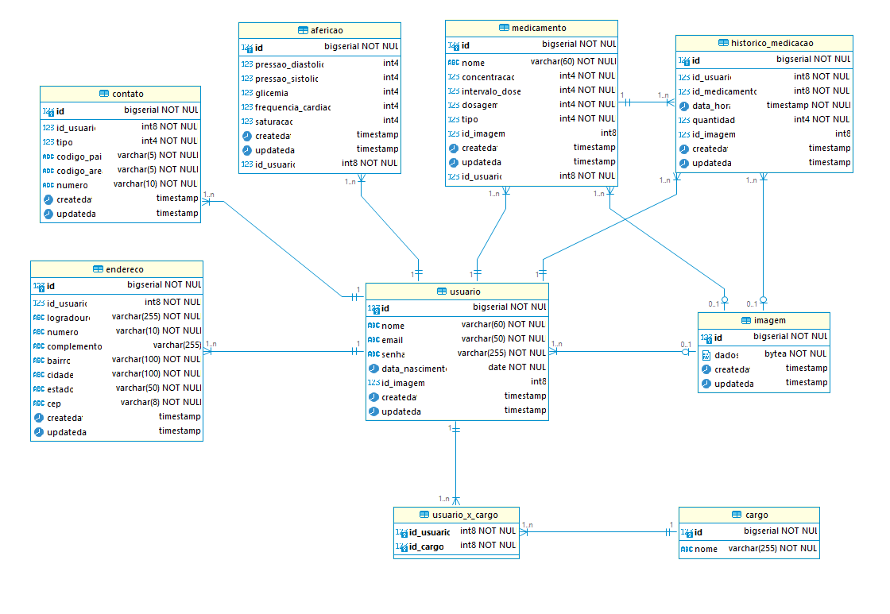

# Projeto TCC - Monitoramento de Saúde  

Este projeto tem como objetivo desenvolver uma solução para o monitoramento de 
dados de saúde, como pressão arterial, glicemia, frequência cardíaca e saturação de 
oxigênio, integrando uma API REST, um aplicativo mobile e, possivelmente, uma interface web.


## Tecnologias Utilizadas  

### Backend

- Java
- Spring Boot
- PostgreSQL

### Mobile

- Dart
- Flutter

### Web (possível implementação futura)
- HTML
- CSS
- JavaScript
- React


## Diagrama do Banco de Dados




## Instalação

1. Clone o repositório:

```bash
 git clone https://github.com/kacielriff/project-tcc.git
```

2. Acesse o diretório do projeto:

```bash
 cd project-tcc/
```

3. Compile e rode o projeto.


## Licença  

Este projeto está licenciado sob a Licença MIT. Veja o arquivo [LICENSE](./LICENSE) para mais detalhes.